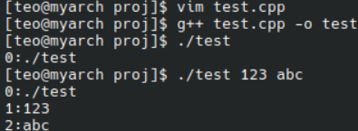
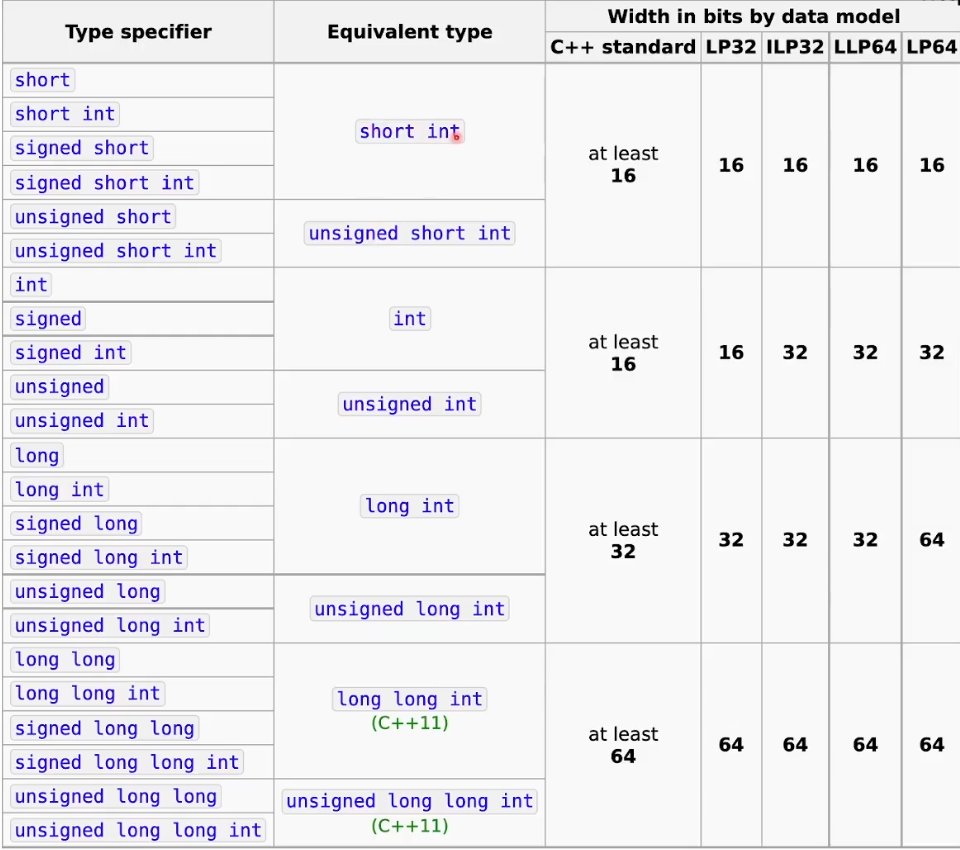
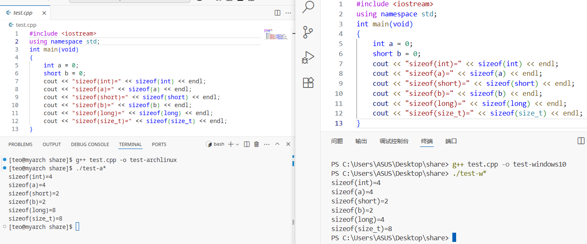
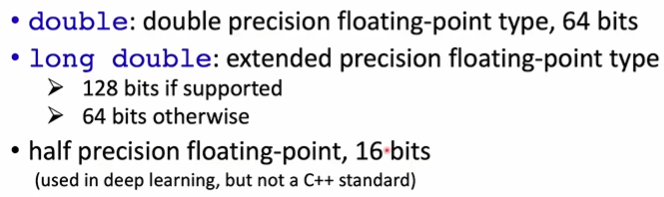

# C/C++程序设计笔记

课程：[快速学习C和C++，基础语法和优化策略，学了不再怕指针(南科大计算机系原版)](https://www.bilibili.com/video/BV1Vf4y1P7pq?spm_id_from=333.788.videopod.episodes&vd_source=33952b30ae6467330b98b47ef5fea60f)
课件：[ShiqiYu / CPP](https://github.com/ShiqiYu/CPP)

## Getting Started

### compile and link

compile:
main.cpp(source file) -`g++ -c main.cpp`-> main.o(object file)
mul.cpp(source file) -`g++ -c mul.cpp`-> mul.o(object file)

link:
main.o,mul.o(object file) -`g++ main.o mul.o -o mul`-> mul(executable file)

compile error/link error/runtime error

### preprocessor and macros

preprocessor:预处理
在编译前执行，由预处理器处理
macros:宏
全文替换
```cpp
#include <iostream>
#include <omp.h>
#define PI 3.14159265358//PI是一个宏
#if defined(_OPENMP)
#endif
```

### simple input and output

#### C++ style

output:
```cpp
std::ostream cout;//cout定义，命名空间（防重名）::变量类型 变量;
cout << "Hello." << endl;// 
```
`<<` `>>`:运算符，函数 << 参数
函数调用函数的返回值依然是cout，所以可以链式调用
`endl`:endline，本行结束

input:
```cpp
std::istream cin;//cin定义
```
```cpp
int a,b;
cin >> a;
cin >> b;
```

#### C style

output:
```c
int v = 100;
printf("Hello,value is %d\n.",v);
```
```c
int printf(const char *format,...);//printf定义
```

input:
```c
int v;
int ret = scanf("%d",&v);//取地址符&
```

#### command line arguments

```c
int main (int argc,char *argv[]){...}
```
命令行参数
argc:arguments count,参数个数
argv:argument vector，参数值组成的数组
*argv[]和**argv等价

例如：
```cpp
#include <iostream>
using namespace std;
int main(int argc,char *argv[])
{
    for(int i = 0;i < argc;i++)
    {
        cout << i << ":" << argv[i] << endl;
    }
}
```
结果：


## Data Types and Arithmetic Operators


### integer numbers

```cpp
int a;//declare
a = 1;//assign a value
int b = 2;//declare and initialize
```
```cpp
int a = 56789;
int b = a*a;
unsigned int c = a*a; 
cout << b << endl;//-1069976775，false
cout << c << endl;//3224990521，right
```
造成错误的原因是int最高位符号位，1表示-，0表示+
signed int [-2^31 , 2^31-1]
unsigned int [0 , 2^32-1]
4Byte*8bit/Byte=32bit

C/C++在不同系统上的数值类型大小存在差异：

可以通过操作符`sizeof`进行查看：


size_t是随着计算机内存增长出现的类型
无符号整型，和`sizeof`返回类型一样
可以存储系统最大支持一次处理的位数，一般32bit和64bit

C++11之后引入头文件`<cstdint>`包括
int8_t,int16_t,int32_t,int64_t,uint8_t...
可以使用宏设置其最小值，如
INT8_MIN,INT16_MIN,INT32_MAX.INT64_MAX...

### characters and boolean


#### char

char占1个Byte，是无符号整数类型
```cpp
    char c1 = 'C';//字符C的ASCII码值为67
    char c2 = 80;//ASCII码80对应字符P
    char c3 = 0x50;//0x开头表示十六进制数，50H=80D

    char16_t c4 = u'四';//C++11，UTF-16字符字面量，字符前小写u
    char32_t c5 = U'五' ;//C++11，UTF-32字符字面量，字符前大写U
    //char8_t在C++20支持

    cout << c1 << ":" << c2 << ":" << c3 << endl;
    cout << +c1 << ":" << +c2 << ":" << +c3 << endl;
    //+号将char类型的变量隐式转换为int类
    cout << c4 << endl;
    cout << c5 << endl;
    //c4,c5的类型，std::cout没有专门的输出函数，于是将其作为整数输出
```
结果：
```sh
[teo@myarch 250616]$ g++ 2*.cpp -o 250616 --std=c++11
[teo@myarch 250616]$ ./25*
C:P:P
67:80:80
22235
20116
```

char因为占用内存小被广泛应用于图片存储中

#### bool in C++

bool是C++的关键字，不是C的关键字
bool占1个Byte而不是1bit
true(!=0) false(==0)
```cpp
bool a = true;
int b = a;//implicit conversion
cout << "b=" << b << endl;//b=1
bool c = -1;//true(unrecommended)
```
#### boolean in C

使用`typedef`手动定义bool类型
```c
typedef char bool;
#define true 1;
#define false 0;
```
```c
#include <stdbool.h>//C99
```

### floating-point numbers

float占4Byte,32bit，具体：

其他浮点数：

浮点数的特点是能存小数、存储范围广、处理速度慢、会丢失精度
浮点数由1bit符号位(sign)，8bit指数部分(exponent)和23bit尾数/有效数字部分(mantissa)组成
```c
float f1 = 2.34E+10f;//2.34*10^10
float f2 = f1 + 10;
if(f1 == f2)
    printf("Equal.");//Equal.
//值为aEb的浮点数，当存储数据超过能精确存储的范围，
//即b占位越来越多时，a只能牺牲后方数据精度
```
### arithmetic operators

#### const

const numbers:
```cpp
95//decimal
0137//octal
0x5f//hexadecimal

95//int
95u//unsigned int
95l//long
95ul,95lu//unsigned long

1.2345//1.2345,double
6.02e23//6.02*10^23,double
6.02e23L//6.02*10^23,long double
1.6e-19f//1.6*10^-19,float
```

const type qualifier:
```cpp
//const
const float PI = 3.1415926f;
PI += 1;//error
```

#### auto

```cpp
//auto,C++11
auto a = 1;//int
a = 1.1;//valid,a=1
auto b = 2.3;//double
auto c;//valid in C,error in C++
auto d = a * 4.5;//double
```

#### arithmetic operators

```cpp
+-*/%  ~&|^  << >>
```

operator precedence:
`a++` ->`++a` -> `* /` ->`+ -` > `<< >>`别的用括号得了

#### data type conversions

```cpp
int i1 = 9;
int i2 = 'C';//implicit conversion
int i3 = (int)'C';//explicit conversion,C style
int i4 = int('C');//explicit conversion,function style
int i5 = 2.8;//implicit conversion
float f1 = 2.3;//implicit conversion
short s1 = 650000;//error,more than 2^16 bits
```

参与算数运算的类型只有四种：int,long,float,double

```cpp
unsigned char a = 255;
unsigned char b = 1;
int c = a + b;
cout << "c=" << c << endl;//c=256
```

## Branching and Looping Statements

### if-else and ? operator

```cpp
int num = 10;
if(num < 5)
    cout << "<5" << endl;

if(num == 5)
{
    cout << "==5" << endl;
}
else if(num == 6)
{
    cout << "==6" << endl;
} 
else
{
    cout << "not 5" << endl;
}
```
if-else就近配对

三元运算符`?`:
```cpp
bool isPositive = true;

int factor = 0;
if(isPositive)
    factor = 1;
else
    factor = -1;
//等价于↓
factor = isPositive ? 1 : -1;//
//转换成机器码后都需要跳转回去，导致效率变慢，优化成↓
factor = (isPositive) * 2 - 1;//没有跳转，0*2-1=-1，1*2-1=1
```

### conditions

relationnal expressions:
```cpp
== !=  < > <= >=
//return 1 if the condition is true,0 if false
```

logical expressions:
```cpp
!//negation(逻辑非),not,!a
&&//AND(逻辑与),and,a && b
||//Iclusive OR(逻辑或),or,a || b
//precedence:! -> && -> ||
```
```cpp
float num = 0.2f;
if(!num)//if(num == 0),false
    cout << "won't print" <<endl;

int *p = new int[1024];
if(!p)//if(p == NULL)
    cout << "Memory allocation failed" << endl;
```

### while loop

```cpp
while(expression)
{
    ...;
}//avoid infinite loop
```
```cpp
do
{
    ...;
}while(expression);
```

break:jump out of a loop
continue:start the next loop

### for loop

```cpp
for(init-clause;cond-expression;iteration-expression)
{
    loop statement;
}
```

### goto
goto(unrecommend statenebt):
jump to a desired location

```cpp
if(false)
{
    goto EXIT_ERROR;
}

EXIT_ERROR:
    return -1;
```

### switch statement

```cpp
switch(input);
{
    case 'a':
    case 'A':
        cout << "left" << endl;
        break;
    case 'd':
    case 'D':
        cout << "right" << endl;
        break;
    default:
        cout << "other" << endl;
        break;
}
```
`break`prevents to execute following statements
more similar with `goto`,not `if-else`

## Data Structures

### arrays

- a contiguously allocated memory
- fixed number of objects
- array size can't be changed
- its element type can be any fundamental type(int,float,bool,etc),structure,class,pointer,enumeration
```cpp
int num_array1[5];//uninitialized array,random values
int num_array2[5] = {9,8,7,6,5}//initialization
array2 = array1;//error!
array1[0] = array2[0]//correct
```

num_array2[] in memory:
|index|value|address|
|---|---|---|
||...|...|
|4|5|p+16 ~ p+19|
|3|6|p+12 ~ p+15|
|2|7|p+8 ~ p+11|
|1|8|p+4 ~ p+7|
|0|9|p+0 ~ p+3|
||...|...|

there's no bounds-checking in C/C++

multidimensional arrays:
```cpp
 int rows = 2;
 int columns = 3;
 int mat[rows][columns] = {{11, 12, 13}, {14, 15, 16}};
 for (int r = 0; r < rows; r++)
 {
     for (int c = 0; c < columns; c++)
     {
         cout << mat[r][c] << " ";
     }
     cout << endl;
 }
```
result:
```sh
[teo@archlinux 250625]$ g++ test.cpp -o test
[teo@archlinux 250625]$ ./test
11 12 13 
14 15 16 
```
mat[][columns] in memory:
|index|value|address|
|---|---|---|
||...|...|
|[1][2]|16|p+20 ~ p+23|
|[1][1]|15|p+16 ~ p+19|
|[1][0]|14|p+12 ~ p+15|
|[0][2]|13|p+8 ~ p+11|
|[0][1]|12|p+4 ~ p+7|
|[0][0]|11|p+0 ~ p+3|
||...|...|

the value of columns decides when the next row start,so don't omit

```cpp
const float PI = 3.1415926f;
PI += 1.f;//error
const float values[4] = {1.1f,2.2f,3.3f,4.4f};
value[0] = 1.0f;//error
```

### strings

#### introduction

```cpp
char rabbit[16] = {'P', 'e', 't', 'e', 'r'}; // string
cout << "sizeof(rabbit)=" << sizeo(rabbit) << endl; //array size
cout << "strlen(rabbit)=" << strle(rabbit) << endl;//#include <cstring>string length
for (int i = 0; i < 16; i++)
{
    cout << i << ":" << +rabbit[i] << "(" << rabbit[i] << ")" << endl;
}
char bad_pig[9] = {'P', 'e', 'p', 'p','a',' ', 'P', 'i', 'g'};         //char array
char good_pig[10] = {'P', 'e', 'p','p', 'a',' ', 'P', 'i', 'g', '\0'}; //string
cout << "Rabbit is(" << rabbit << ")"<< endl;
cout << "Pig's bad name is(" <<bad_pig << ")" << endl;
cout << "Pig's good name is(" <<good_pig << ")" << endl;
```
result:
```cpp
sizeof(rabbit)=16//include '\0'
strlen(rabbit)=5//not include '\0'
0:80(P)//index:ASCII:value
1:101(e)
2:116(t)
3:101(e)
4:114(r)
5:0()//"\0"
6:0()
7:0()
8:0()
9:0()
10:0()
11:0()
12:0()
13:0()
14:0()
15:0()
Rabbit is(Peter)//string end with the first'\0'
Pig's bad name is(Peppa PigPeppa Pig)//error!out of bounds
Pig's good name is(Peppa Pig)//correct
```

more convenient way to initial a string:
```cpp
char rabbit[] = "Peter";

const wchar_t[] s1 = L"ABCD";//wide character array
const char16_t[] s2 = u"ABCD";//C++11,UTF-16
const char32_t[] s3 = U"ABCD";//C++11,UTF-32
```
string rabbit in memory:
|index|value|address|
|---|---|---|
||...|...|
|5|0|rabbit+5|
|4|'r'|rabbit+4|
|3|'e'|rabbit+3|
|2|'t'|rabbit+2|
|1|'e'|rabbit+1|
|0|'P'|rabbit+0|
||...|...|

#### manipulation and examination

copy:
```cpp
char* strcpy(char* dest,const char*src);
//may out of bounds
char * strncpy(char *dest,const char *src,size_t count);
//safer
```
concatenate:
```cpp
char *strcat(char *dest,const char *src);
//appends a copy of src to dest
```
compare:
```cpp
int strcmp(const char *lhs,const char *rhs);
```

example:
```cpp
char s1[] = "Hello,\0CPP";
char s2[] = "SUSTech";
char s3[128];
strcpy(s3,s1);
cout << "s3=" << s3 << endl;
//s3=Hello,
strcat(s3,s2);
cout << "s3=" << s3 << endl;
//s3=Hello,SUSTech
cout << "strcmp(s1,s2)=" << strcmp(s1,s2) << endl;
//strcmp(s1,s2)=-11
```

#### string class

```cpp
std::string s1 = "Hello";
std::string s2 = "SUSTech";
std::string s3 = s1 + ", " + s2;
cout << "s3=" << s3 << endl;
//s3=Hello, SUSTech
cout << "length of s3 is" << s3.length() << endl;
//length of s3 is 14
cout << "s1 < s2 is" << (s1 < s2) << endl;
//s1 < s2 is 1('H'<'S',true)
```

different types of strings:
```cpp
std::string
std::wstring
std::u8string//C++20
std::u16string//C++11
std::u32string//C++11
```

### structures unions and enumerations