# CS61B

[Home | CS 61B Spring 2024](https://sp24.datastructur.es/)
[CS 61B Staff](https://github.com/Berkeley-CS61B)
[cs61b | CS自学社区](https://www.learncs.site/docs/curriculum-resource/cs61b/cs61b_ch)

## Java

### 1.Introduction

hello world in java:
```java
public class HelloWorld{
    public static void main(String[] args){
        System.out.println("Hello,world!");
    }
}
```
HelloWorld.java 
↓Compiler`javac`
HelloWorld.class
↓Interpreter`java`
```sh
Hello,world!
```
in terminal:
```sh
[teo@myarch java250702]$ javac HelloWorld.java
[teo@myarch java250702]$ java HelloWorld
Hello,world!
```


### 2. Defining and Using Classes

#### define and instantiate classes

1. every method is associated with some classes
2. to run a class,must define a main method
3. not all classes have a main method


```java
package test;
public class Dog{
    public static void makeNoise(){
        System.out.println("Bark!");
    }//can't run directly because no main method
}
```
```java
package test;
public class DogLauncher{
    public static void main(String[] args){
        Dog.makeNoise();
    }//calls a method from another class
}
```
result:
```sh
Bark!
```

#### static and non-static methods

classes can not only contain functions/methods,but also data:
```java
package dogdog;
public class Dog{
    public int weightInPounds;
    //instance variable(实例变量),a general element to all dogs

    public Dog(int startingWeight){
        weightInPounds = startingWeight;
    }
    //constructor(构造函数),the same name to the class
    //similar to a method but not,determines how to instantiate the class
    
    public void makeNoise(){
        if(weightInPounds < 10){
            System.out.println("yip");
        }else if(weightInPounds < 30){
            System.out.println("bark");
        }else{
            System.out.println("woof");
        }
    }
    //non-static method(非静态方法)/instance method(实例方法)
    //if the method's going to be invoked by an instance(aka object) of the class,it should be non-static
}
```
```java
package dogdog;
public class DogLauncher{
    public static void main(String[] args){
        Dog.makeNoise();//error,makeNoise isn't static
        Dog d = new Dog(15);
        d.makeNoise();//okay,create an object to invoke the non-static method
        //bark

        Dog a;//not initialize yet
        a = new Dog(10);//assign a value to a
        Dog b = new Dog(20);
        a = b;
        a.weightInPounds = 30;
        a.makeNoise();
        //woof

        Dog[] dogs = new Dog[2];//creates an array of dogs of size 2
        dogs[0] = new Dog(8);
        dogs[1] = new Dog(20);
        dogs[0].makeNoise();
        //yip
    }
}
```
```java
//when there are 2 or more constructors:
public class Dog{
    public int weightInPounds;
    public String name;

    //version with dogName
    public Dog(int startingWeight, String dogName) {
        weightInPounds = startingWeight;
        name = dogName;
    }

    //version without dogName
    public Dog(int startingWeight) {
        this(startingWeight, "No Name"); 
        //this(...)
        //pass ... to the other constructor
    }
}
```

1. `static`methods are invoked using the class name,e.g.`Dog.makeNoise()`
2. instance methods are invoked using an instance name,e.g.`maya.makeNoise()`
3. if having a non-static method,the non-static method is specific to one dog

static:
```java
public static void makeNoise(){
    System.out.println("bark");
}
```
```java
Dog.makeNoise();
```
some classes are never instantiated
for example,Math
```java
double x = Math.round(5,6);
```

non-static:
```java
public void makeNoise(){
    if(weightInPounds < 10){
        System.out.println("yip");
    }else if(weightInPounds < 30){
        System.out.println("bark");
    }else{
        System.out.println("woof");
    }
}
```
```java
Dog maya = new Dog(15);
maya.makeNoise();
```

ways to  return the heavier dog:

```java
//with `static`
public static Dog maxDog(Dog d1,Dog d2){
    if(d1.weightInPounds < d2.weightInPounds){
        return d2;
    }else{
        return d1;
    }
}
```
```java
Dog larger = Dog.maxDog(dog1,dog2);//a class invokes the method
```
or
```java
//no `static`
public Dog maxDog(Dog d2){
    if(weightInPounds < d2.weighInPounds){
        return d2;
    }else{
        return this;
    }
}
```
```java
Dog larger = dog1.maxDog(dog2); //an object invokes the method
```

### 3. Lists I

#### reference type

```java
int x = 5;
int y;
y = x;
x = 2;
System.out.println("x = " + x);//x = 2
System.out.println("y = " + y);//y = 5
```
however
```java
Walrus a = new Walrus(1000,8.3);
Walrus b;
b = a;
b.weight = 5;
System.out.println(a);//weight:5,tusk size:8.30
System.out.println(b);//weight:5,tusk size:8.30
```

- computers store information in memory,like integer 72 stored as 01001000,character H also stored as 01001000 according to ASCII
- 8 primitive types in java:`byte` `shore` `int` `long` `float` `double` `boolean` `char`
- everything else,including arrays and `String`,are "reference type"(引用类型)

1. when an Object is instantiated(e.g.Dog,Walrus),java first allocates a box of bits for each instance variable of the class and fills them with a default value(e.g.0,null)
2. the constructor then usually fills every such box with some other value

```java
new Walrus(1000,8.3);
```
3. can think of `new` as returning the address of the newly created object.for example, if the object is created in memory location 1234567890,then `new` returns 1234567890

```java
Walrus someWalrus;
someWalrus = null;
```

4. addresses in java are 64 bits,these bits can be either set to null or the 64 bits "address" of a specific instance of that class(return by `new`)

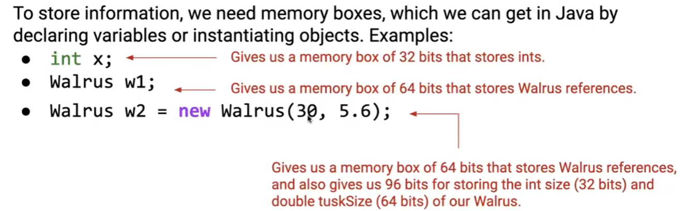

#### array

```java
Planet p = new Planet(0,0,0,0,0,"blah.png");
int[] x = new int[]{0,1,2,95,4};//declaration,instantiation and assignment
```
arrays are also objects,objects are usually instantiated using the `new` keyword

```java
int[] a;//declaration
```
- declaretion creates a 64 bit box intended only for storing a reference to an int array
- no object is instantiateds

```java
new int[]{0,1,2,95,4};
```
- instantiates a new object,in this case an int array
- object is anonymous essentially in java

#### lists

```java
public class IntList {
    public int first;
    public IntList rest;

    public static void main(String[] args) {
        IntList L = new IntList();
        L.first = 5;
        L.rest = new IntList();
        L.rest.first = 10;
        L.rest.rest = new IntList();
        L.rest.rest.first = 15;
    }
}
```
or
```java
public class IntList {
    public int first;
    public IntList rest;
    public IntList(int f, IntList r) {
        first = f;
        rest = r;
    }

    public static void main(String[] args) {
        IntList L = new IntList(15,null);
        L = new IntList(10,L);//recursion
        L = new IntList(5,L);
    }
}
```
↓↓↓
`[5] -> [10] -> [15] -> null`
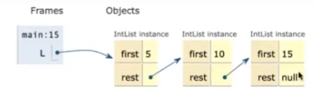

how to count the size of the list:
```java
public int size(){
    if(rest == null){
        return 1;
    }
    return 1 + rest.size();//recursion
}
```
or
```java
public int interativeSize(){
    int totalSize = 0;
    IntList p = this;//this:a reference to the current object
    while(p != null){
        totalSize += 1; 
        p = p.rest;//iteration
    }
    return totalSize;
}
```

write a get method through recursion:
```java
public int get(int i){
    if(i == 0){
        return first;
    }
    return rest.get(i - 1);
}
```

### 4. Lists II

#### Singly Linked List

a more proper way:
```java
public class IntNode{
    public int item;
    public IntNode next;
    public IntNode(int i,IntNode n){
        item = i;
        next = n;
    }
}//IntNode is dumb now,has no methods 
```
↓↓↓can also be nested in SLList(`private static class IntNode{...}`，IntNode then is only used for the internal implementation of SLList)
```java
public class SLList{
    //use `private` keyword to hide implementation details from users of the class
    private IntNode first;
    //creates a new SLList with one item,namely x
    public SLList(int x){
        first = new IntNode(x,null);
    }
    //add item x to the front of the list
    public void addFirst(int x){
        first = new IntNode(x,first);
    }
    //get the first item in the list
    public int getFirst(){
        return first.item;
    }

    public static void main(String[] args){
        SLList L = new SLList(5);
        L.addFirst(10);
        L.addFirst(15);
        System.out.println(L.getFirst());//15
    }
}
```

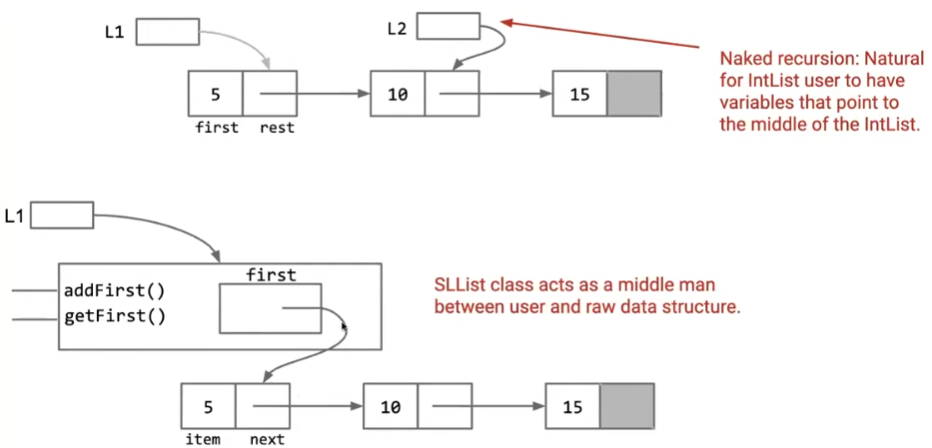

the `private` prevent code like:
```java
SLList L = new SLList(5);
L.first = null;//directly disturb the structure of the linked list
System.out.println(L.getFirst());//NullPointerException!
```
or
```java
L.first.next = new IntNode(999, null);//bypass the addFirst method and directly tamper with the linked list structure
```

hide implementation details from users of the class,
1. less for user of class to understand
2. safe for you to change private implementation
3. but still nothing to do with protection against hackers,spies and other evil entities

#### more methods for SLList

create addLast and size method for SLList:
```java
//add x to the end of the list
public void addLast(int x){
    IntNode p = first;
    while(p.next != null){
        p = p.next;//iteration
    }
    p.next = new IntNode(x,null);
}

//return the size of the list
public int size(){
    return size(first);
}

//return the size of the list,starting at IntNode p
private int size(IntNode p){
    if(p.next == null){
        return 1;
    }
    return 1 + size(p.next);//recursion
}

/*
//or
public int size() {
    if (first == null) return 0;
    return 1 + size(first.next);
}//poor readability
*/
```

#### faster size()

```java
public class SLList{
    private IntNode first;

    //...

    private int size(IntNode p){
        if(p.next == null){
            return 1;
        }
        return 1 + size(p.next);
    }

    public int size(){
        return size(first);
    }
}
```
↓↓↓
```java
public class SLList {
    private IntNode first;
    private int size;//all S lists have a size

    public SLList(int x) {
        first = new IntNode(x, null);
        size = 1;//size is 1
    }

    public void addFirst(int x) {
        first = new IntNode(x, first);
        size += 1;//size grow by 1
    }

    public int getFirst() {
        return first.item;
    }

    public void addLast(int x){
        IntNode p = first;
        while(p.next != null){
            p = p.next;
        }
        p = new IntNode(x,null);
        size += 1;//size grow by 1
    }

    public int size(){
        return size;
    }
```

- the solution is maintaining a special size variable that caches the size of the list
- caching:putting aside data to speed up retrieval,use a bit of extra memory in exchange for getting faster size()

#### empty list

- benefits of SLList vs. IntList so far:
  1. faster size() method than would have been convenient for IntList
  2. User of an SLList never sees the IntList class
- also it's easy to represent the empty list by setting first to null
- in the above code there's a subtle bug,it crashes when calling addLast on the empty list:
    ```java
    public void addLast(int x){
        IntNode p = first;
        while(p.next != null){
            p = p.next;
        }
        p = new IntNode(x,null);
        size += 1;
    }
    ```
    can't ask the null-th item for its next element like `null.next`
    so change to:
    ```java
    public void addLast(int x){
        size += 1;
        if(first == null){
        first = new IntNode(x,null);
        return;
    }
        IntNode p = first;
        while(p.next != null){
            p = p.next;
        }
        p.next = new IntNode(x,null);
        
    }
    ```

how to make all SLLists(even empty) consistant of consistency:
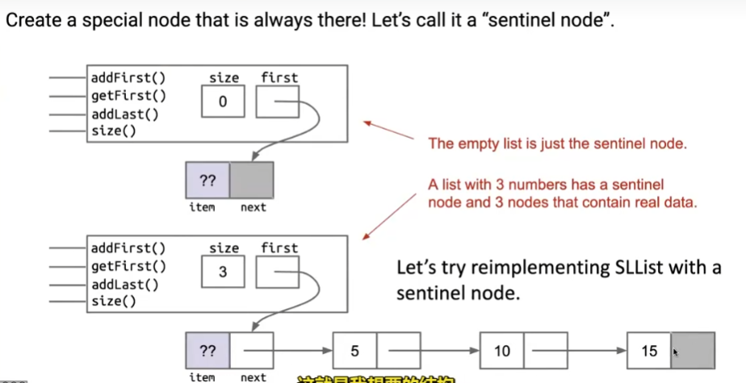
```java
public class SLList{
    //the first item,if it exists,is at sentinel.next
    private IntNode sentinel;
    private int size;

    public SLList(int x){
        sentinel = new IntNode(0,null);
        sentinel.next = new IntNode(x, null);
        size = 1;
    }

    //create an empty SLList
    public SLList(){
        sentinel = new IntNode(0,null);
        size = 0;
    }

    public void addFirst(int x){
        sentinel.next = new IntNode(x, sentinel.next);
        size += 1;
    }

    public int getFirst(){
        return sentinel.next.item;
    }

    public void addLast(int x){
        size += 1;
        IntNode p = sentinel;
        while(p.next != null){
            p = p.next;
        }
        p.next = new IntNode(x,null);
    }

    public int size(){
        return size;
    }
```
(an "invariant" is a condition that is guaranteed to be true during code execution(assuming there are no bugs in the code))
- an SLList with a sentinel node has at least the following invariants:
  1. the sentinel reference always points to the sentinel node
  2. the first node(if exists) is always at sentinel.next
  3. the size variable is always the total number of items that have been added
- invariants make it easier to reason about code:
  1. can assume they are true in order to simplify code(e.g. addLast doesn't need to worry about nulls)
  2. must ensure that methods preserve invariants

### 5. Lists III

#### Doubly Linked List and Circular Linked List

inserting at the back of an SLList is much slower than the front,how to make them almost fast?
1. 
- add backwards links from every node
- this yields a "doubly linked list" or DLList,as opposed to our earlier "singly linked list" or SLList

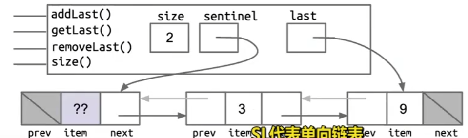
2. 
- arrows point at entire node,not fields
e.g. last holds the address of the last node,not the item field of the sentinel node
- last sometimes points at the sentinel,and sometimes points at a "real" node,one solution is having two sentinels,another solution is let the  last sentinel point to sentinel 
  
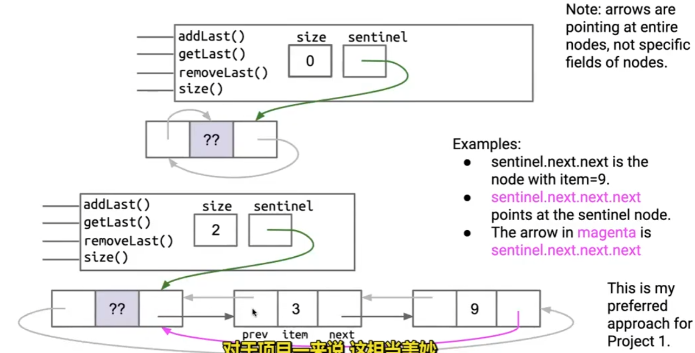

#### generics 

generics(泛型) allow developers to define type-safe classes, interfaces, and methods with type parameters
the core idea of generics is to parameterize data types, enabling the same code logic to work with different data types without duplication

```java
public class SLList<BleepBlorp>{
    private IntNode sentinel;
    private int size;
    public class IntNode{
        public BleepBlorp item;
        public IntNode next;
        ...
    }
    ...
}
```
- in java file implementing your data structure,specify your "generic type" only once at the very top of the file
- in java files that use your data structure,
  1. write out desired type during declaration
  2. use the empty `<>` during instantiation
```java
SLList<Intger> s1 = new SLList<>(5);
s1.addFirst(10);
SLList<String> s2 = new SLList<>("hi");
s2.addFirst("apple");
//int:Integer double:Double char:Character boolean:Boolean long:Long
```

#### array again

- arrays are a special kind of object which consists of a numbered sequence of
memory boxes
- to get i-th item of array A, use A[i]
- unlike class instances which have named memory boxes
- arrays consist of:
  1. a fixed integer length(can't change)
  2. a sequence of N memory boxes where N=length,such that:
    - all of the boxes hold the same type of value(and bits)
    - the boxes are numbered 0 through length-1
- like instances of classes:
  - you get one reference when it's created
  - if you reassign all variables containing that reference,you can never get the array back
- unlike classes,arrays don't have methods 
```java
x = new int[3];
y = new int[]{1,2,3,4,5};
int[] z = {6,7,8,9,10};
```

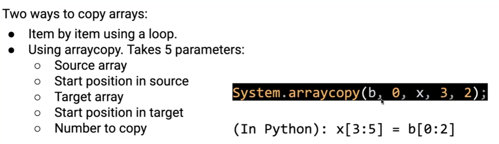

unlike C standard,the second position of 2d array in java is not necessary,a 2d array in java is not a contiguous memory space,it is an irregular (jagged) structure,meaning each row can have a different length:
```java
int[][] pascalsTriangle;//array of int array references
pascalsTriangle = new int[4][];//create four boxes,each can store an int array reference
int[] rowZero = pascalsTriangle[0];

pascalsTriangle[0] = new int[]{1};
pascalsTriangle[1] = new int[]{1,1};
//↓create a new array with 3 boxes,storing 1,2,1 respectively
//↓store a reference to this array in pascalsTriangle box #2
pascalsTriangle[2] = new int[]{1,2,1};
pascalsTriangle[3] = new int[]{1,3,3,1};
/*
pascalsTriangle → [
    [1],
    [1, 1],
    [1, 2, 1],
    [1, 3, 3, 1]
]
*/
int[] rowTwo = pascalsTriangle[2];
rowTwo[1] = -5;
/*
pascalsTriangle → [
    [1],
    [1, 1],
    [1, -5, 1],
    [1, 3, 3, 1]
]
*/

int[][] matrix;
matrix = new int[4][];//create 1 total array
matrix = new int[4][4];//create 5 total arrays

int[][] pascalAgain = new int[][]{{1},{1,1},{1,2,1},{1,3,3,1}}
```

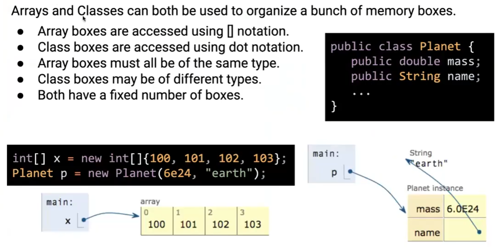

arrays indices can be computed at runtime,class member variable names can't be computed and used at runtime

### 6. Test

#### Junit

the most natural approach to testing would be to start with an input and expected result
```java
public class TestSort{
    public static void testSort(){
        String[] input = {"AA", "BB", "CC", "DD"};
        String[] expected = {"AA","BB","CC","DD"};
        ...
    }
    public static void main(String[] args){
        testSort(); 
    }
}
```
this is the most primitive method,which is annoying and thankless
`org.junit` library provides many useful methods for simplifying coding
```xml
<dependencies>
<!--JUnit5 unit testing framework-->
    <dependency>
    <!--allow IDEs or build tools (such as Maven or Gradle) to discover and execute tests programmatically-->
        <groupId>org.junit.platform</groupId>
        <artifactId>junit-platform-launcher</artifactId>
        <scope>test</scope>
    </dependency>
    <dependency>
    <!--responsible for executing tests written using the JUnit Jupiter API-->
        <groupId>org.junit.jupiter</groupId>
        <artifactId>junit-jupiter-engine</artifactId>
        <scope>test</scope>
    </dependency>
    <dependency>
    <!--test cases for compatibility and operation with both JUnit 3 and JUnit 4-->
        <groupId>org.junit.vintage</groupId>
        <artifactId>junit-vintage-engine</artifactId>
        <scope>test</scope>
    </dependency>
</dependencies>
```
```java
import org.junit.jupiter.api.Test;
import static org.junit.jupiter.api.Assertions.assertEquals;

@Test
void testAddition() {
    Calculator calculator = new Calculator();
    int result = calculator.add(2, 3);
    assertEquals(5, result);
}
```

just look at
[Junit5 架构、新特性及基本使用（常用注解与套件执行） - 知乎](https://zhuanlan.zhihu.com/p/161623597)

#### Truth

In CS61B,we use Google's Truth assertions library. We use this library over JUnit assertions for the following reasons:
- Better failure messages for lists.
- Easier to read and write tests.
- Larger assertions library out of the box.

We often write tests using the Arrange-Act-Assert pattern:
1. Arrange(准备) the test case, such as instantiating the data structure or filling it with elements.
2. Act(执行) by performing the behavior you want to test.
3. Assert(断言) the result of the action in (2).

A Truth assertion takes the following format:
```java
assertThat(actual).isEqualTo(expected);
```

To add a message to the assertion, we can instead use:
```java
assertWithMessage("actual is not expected")
    .that(actual)
    .isEqualTo(expected);
```

We can use things other than `isEqualTo`, depending on the type of `actual`. For example, if `actual` is a `List`, we could do the following to check its contents without constructing a new `List`:
```java
assertThat(actualList)
    .containsExactly(0, 1, 2, 3)
    .inOrder();
```

If we had a `List` or other reference object, we could use:
```java
assertThat(actualList)
    .containsExactlyElementsIn(expected)  // `expected` is a List
    .inOrder();
```

Truth has many assertions, including isNull and isNotNull; and isTrue and isFalse for booleans. IntelliJ's autocomplete will often give you suggestions for which assertion you can use.

### 7. Lists IV

#### AList

when there are too many elements in a linked list, will the retrieval slow down no matter what,so we should use arrays instead，retrieval from any position of an array is very fast

```java
public class AList {
    //basic functions
    private int[] items;
    private int size;
    public AList() {
        items = new int[100];
        size = 0;
    }
    public void addLast(int x) {
        items[size] = x;
        size += 1;
    }
    public int getLast() {
        return items[size - 1];
    }
    public int get(int i) {
        if(i >= items.length) {
            throw new IllegalArgumentException();
        }
        return items[i];
    }
    public int size() {
        return size;
    }
}
```

#### removeLast() and addLast()

1. the position of the next item to be inserted is always size
2. size is always the number of items in the AList
3. the last item in the list is always in position size-1
therefore,when removing the last element in the array,
```java
public int removeLast() {
    int x = item[size - 1];
    //item[size - 1] = 0;  <-  isn't necessary
    size -= 1;
    return x;
}
```

if the array is full and can't give more space,we can make a new array
```java
//modified addLast
public void addLast(int x) {
    if (size == items.length) {
        int[] a = new int[size + 1];
        System.arraycopy(items, 0, a, 0, size);
        items = a;//points to a new array
    }
    items[size] = x;
    size += 1;
}
```
↓↓↓ easier to read,understand,and test
```java
//resize the underlying array to the target capacity
private void resize(int capacity) {
    int[] a = new int[capacity];
    System.arraycopy(items, 0, a, 0, size);
    items = a;
}
//insett into the back of the list
public void addLast(int x) {
    if (size == items.length) {
        resize(size + 1);
    }
    items[size] = x;
    size += 1;
}
```
- invoking this method twice requires creating and filling 101+102=203 total memory boxes,which is too slow
- if calling addLast until size = 1000,roughly 500000 total array memory boxes work(101+102+...+1000)
- obviously size+1 or size+10 won't change the nature of the curve(O(n^2)):
  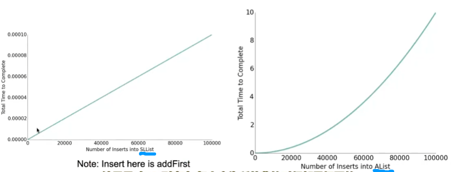

faster addLast():
```java
public void addLast(int x) {
    if (size == items.length) {
        resize(size * 2);//every time a new array is needed,create double the size(O(n))
    }
    items[size] = x;
    size += 1;
}
```

an AList shouldn't only be efficient in time,but also in space
- can define the "usage ratio" `R = size / items.length;`
- typical solution:half array when R < 0.25

space efficiency and time efficiency will be studied in the future

#### generic Alists

```java
public class Alist<Glorp> {
    private Glorp[] items;
    private int size;
    public Alist() {
      //items = new Glorp[100];  <-  syntax error in java!
        items = (Glorp[]) new Object[8];//  <-  okay
        size = 0;
    }
    private void resize(int cap) {
        Glorp[] a = (Glorp[]) new Object[cap];
        System.arraycopy(items, 0, a, 0, size);
        items = a;
    }
    public Glorp get(int i) {
        return items[i];
    }
    ...
} 
```

unlike integer based ALists,we actually want to null out deleted items
- java only destroy unwanted objects when the last reference has been lost
- keeping references to unneeded objects is sometimes called "loitering"
- save memory,don't loiter
```java
public Glorp removeLast() {
    Glorp returnItem = getLast();

    //no more references,garbage collector works
    items[size - 1] = null;
    
    size -= 1;
    return returnItem;
}
```

### 8. Inheritance I

#### interface and implementation

java allows multiple methods with same name,but different parameters,this is called method "overloading(重载)"
```java
public class OneClass {
    public static String longest(AList<String> list) {
    ...
    }
    public static String longest(SLList<String> list) {
    ...
    }
}
```

but it looks bad and hard to maintian, won't work for future lists,if creating a QList class,have to make a third method

List is a hypernym of SLList and AList，express this in java is a two-step process:
1. define a reference type for the hypernym
2. specify that SLLists and ALists are hyponyms of that type

- use the new keyword `interface` instead of `class` to define a List61B
- interface is a specification of what a List is able to do,not how to do it:
```java
public interface List61B<Blorp> {
    public void addFirst(Blorp x);
    public void addLast(Blorp x);
    public void insert(Blorp x, int position);
    public Blorp getFirst();
    public Blorp getLast();
    public Blorp removeLast();
    public Blorp get(int i);
    public int size();
}
```
use the new keyword `implements` to tell java compiler SLList and AList are hyponyms of List61B
```java
public interface List61B<Item> {
    public void addLast(Item y);//no actual code here
    ...
}
```
if a implementing class has a method with the exact same signature as in the interface,the implementing class overrides the method
```java

public class AList<Item> implements List61B<Item> {
    ...
    public void addLast(Item x) {//ite overrides the List61B's addLast()
        ...
    }
}
```

we can now adjust this method to work on either kind of list:
```java
public static String longest(List61B<String>list) {
    int maxDex = 0;
    for(int i = 0; i < list.size(); i +=1) {
        String longestString = list.get(maxDex);
        String thisString = list.get(i);
        if (thisString.length() > longestString.length()) {
            maxDex = i;
        }
    }
    return list.get(maxDex);
}
```
```java
public static void main(String[] args) {
    AList<String> a = new AList<>();
    a.addLast("egg");
    a.addLast("cat");
    longest(a);
}
```

difference between override and overload:
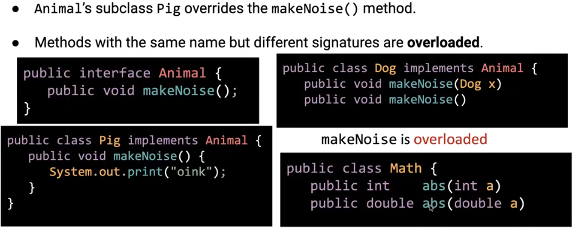

- adding `@Override` before a function makes it easier to read,declares it was overwritten from a interface
- the `implements List61B<Item>` is essentially a commitment,AList states it will own and define all the elements and behaviors specified in the List61B interface
- if List61B defines a method and AList/SLList doesn't realize it,the compiler will report the error 

use the keyword `default` in an interface to provide default implementations:
```java
public interface MyList {
    ...
    default public void print() {
        for (int i = 0; i < size(); i += 1) {
            System.out.print(get(i) + " ");
        }
        System.out.println();
    }
}
```
can be overridden by implementing classes:
```java
public class MyLinkedList implements MyList {
    ...
    @Override
    public void print() {
        for (Node p = sentinel.next; p != null; p = p. next) {
            System.out.print(p.item + " ");
        }
    }
}
```

#### static and dynamic type

```java
public static void main(String[] args) {
    List61B<String> someList = new SLList<String>();//is dogA a Dog?yes!
    someList.addLast("1");
    someList.addLast("2");
    someList.addLast("3");
    someList.print();//using SLList.print(),not List61B.print(),reason↓↓↓
}
```
- 1. every variable in java has a "compile-time type", a.k.a. "static type"
  2. this is the type specified at declaration,it never changes
  3. the compoler determines which methods can be called based on static type
- 1. variables also have a "run-time type" a.k.a. "dynamic type"
  1. this is the type specified at instantiation(e.g. when using `new`)
  2. equal to the type of the object being pointed at
   
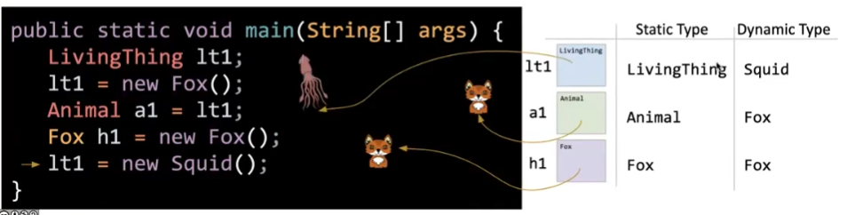

### 9. Inheritance II

build a RotatingSLList that can perform any SLList operation as well as,and include a rotateRight() method to move back item the front
example: [1, 2, 3, 4, 5] -> [5, 1, 2, 3, 4]

if you want one class to be a hyponym of another class(instead of an interface),use keyword `extends`:
```java
public class RotatingSLList<Item> extends SLList<Item> {
    public void rotateRight() {
        Item x = removeLast();
        addFirst(x);
    }

    public static void main(String[] args) {
        RotatingSLList<Integer> rsl = new RotatingSLList<>();//"Integer" in <> can be omitted since java7
        //creates S-list:[10, 11, 12, 13]
        rsl.addLast(10);
        rsl.addLast(11);
        rsl.addLast(12);
        rsl.addLast(13);

        //should be:[13, 10, 11, 12]
        rsl.rotateRight();
        rsl.print();
    }
}
```
by `extends` RotatingSLList inherits all members of SLList(instance and static variables,methods,nested classes)except constructors,but members may be private and thus inaccessible

VengefulSLList has an additional method printLostItems(),which prints all deleted items
```java
public class VengefulSLList<Item> extends SLList<Item> {
    SLList<Item> lostItems;

    public VengefulSLList() {
        //super();  <-  must come first,can be omitted 
        lostItems = new SLList<>();
    }

    public VengefulSLList(Item x) {
        super(x);// <-  must give parameters like x to super(),otherwise default super()
        lostItems = new SLList<>();
    }

    public void printLostItems() {
        lostItems.print();
    }

    @Override
    public Item removeLast(Item x) {
        item x = super.removeLast();
        lostItems.addLast(x);
        return x;
    }

    public static void main(String args) {
        VengefulSLList<Integer> vsl = new VengefulSLList<>();
        vsl.addLast(1);
        vsl.addLast(5);
        vsl.addLast(10);
        vsl.addLast(13);//vsl is now:[1, 5, 10, 13]
        vsl.removeLast();
        vsl.removeLast();//vsl is now:[1, 5]
        System.out.print("the fallen are: ");
        vsl.printLostItems();//the fallen are: 13 10
    }
}
```

VengefulSLList extends SLList,SLList extends Object implicitly

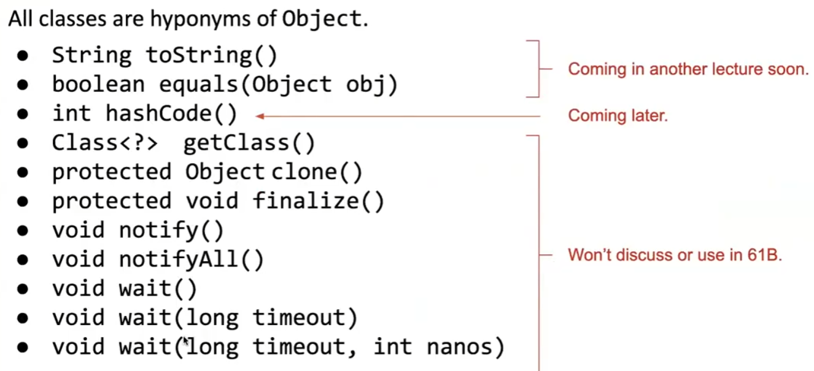

java7 and earlier versions have a fundamental issue:memory boxes(variables) can't contain pointers to functions
can use an interface instead:
```java
public interface IntUnaryFunction {
    public int apply(int x);
}
```
```java
public class TenX implements IntUnaryFunction {
    @Override
    public int apply(int x) {
        return 10 * x;
    }
}
```
```java
public class HoFDemo {
    public static int doTwice(IntUnaryFunction f, int x) {
        return f.apply(f.apply(x));
    }//it's a higher-order function
    public static void main(String[] args) {
        int result = doTwice(new TenX(), 2);
        /*
        IntUnaryFunction func = new TenX();
        //in python:
        def tenX(x):
            return 10 * x
        func = tenX
        */
        System.out.println(result);//200,/TexX(Tenn(2)) -> 10*(10*2)=200
    }
}
```

in java8,new types were introduced,now can hold references to methods,without `new` 
```java
public class Java8HofDemo {
    public static int tenX(int x) {
        return 10*x;
    }
    public static int doTwice(Functio<Integer, Integer> f, int x) {
        return f.apply(f.apply(x));
    }
    public static void main(String[] args) {
        int result = doTwice(Java8HofDemo::tenX, 2);
        System.out.println(result);
    }
}
```

### 10. Inheritance III

subtype polymorphism:子类型多态性
polymorphism:provides a single interface to entities of different types
consider a variable deque of static type Deque:
- when calling deque.addFirst(),the actual behavior is based on the dynamic type,a.k.a. run-time type
- java automatically selects the right behaviod using what's sometimes called "dynamic method selection"

write a function max() that returns the max of any array,regardless of type
```java
public interface OurComparable {
    /**
     * return -1 if less than o
     * return 0 if equal to o
     * return 1 if more than o
     */
    public int compareTo(Object o);
}
```
```java
public class Dog implements OurComparable{
    public String name;
    private int size;
    public Dog(String n,int s) {...}
    public void bark(){System.out.println(name + "says: bark!")};

    @Override
    public int compareTo(Object o) {
        Dog otherDog = (Dog) o;
        if (this.size < otherDog.size) {
            return -1;
        } else if (this.size == otherDog.size) {
            return 0;
        } else {
            return 1;
        }
        /**
         * or:
         * return this.size - otherDog.size;
         */
    }
} 
```
```java
public class Maximizer {
    public static OurComparable max(OurComparable[] items) {
        int maxDex = 0;
        for (int i = 0; i < items.length; i +=1) {
            int cmp = items[i].compareTo(items[maxDex]);
            if (cmp > 0) {
                maxDex = i;
            }
        }
    }
    return 
}
```
```java
public static void main(String[] args) {
    Dog[] dogs = {
        new Dog("Elyse", 3),
        new Dog("Sture", 9),
        new Dog("Benjamin", 15)
    };
    Dog maxDog = (Dog) Maximizer.max(dogs);
    maxDog.bark();//Benjamin says: bark!
}
```

better version:
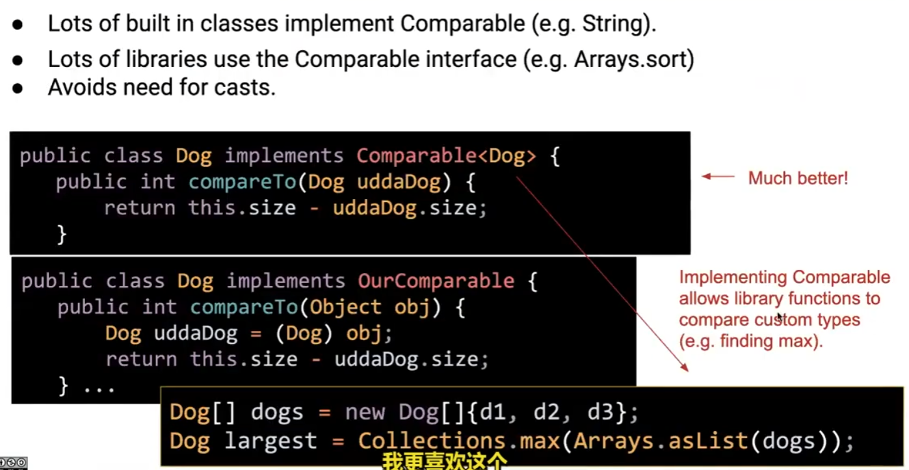

implement a new comparator that compares things by size:
```java
import java.util.Comparator;//java standard library

//can be nested in Dog,with `static`
public class NameComparator implements Comparator<Dog> {
    @Override
    public int compare(Dog o1, Dog o2) {
        return o1.name.compareTo(o2.name);/
    }
}
```
```java
public static void man(String[] args) {
    ...
    Dog d4 = new Dog("Osiki", 200);
    Dog d5 = new Dog("Cerebus", 99999);
    NameComparator nc = new NameComparator();
    int cmp = nc.compare(d4, d5);
    if (cmp > 0) {
        d4.bark();
    } else {
        d5.bark();
    }
    //Oski comes later in the alphabet
    //Oski says: bark!
}
```

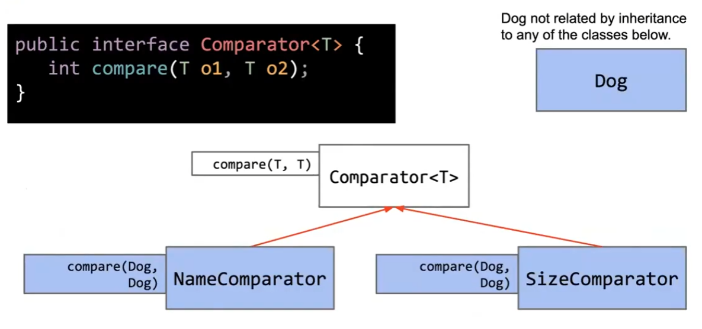

### 11. Inheritance IV